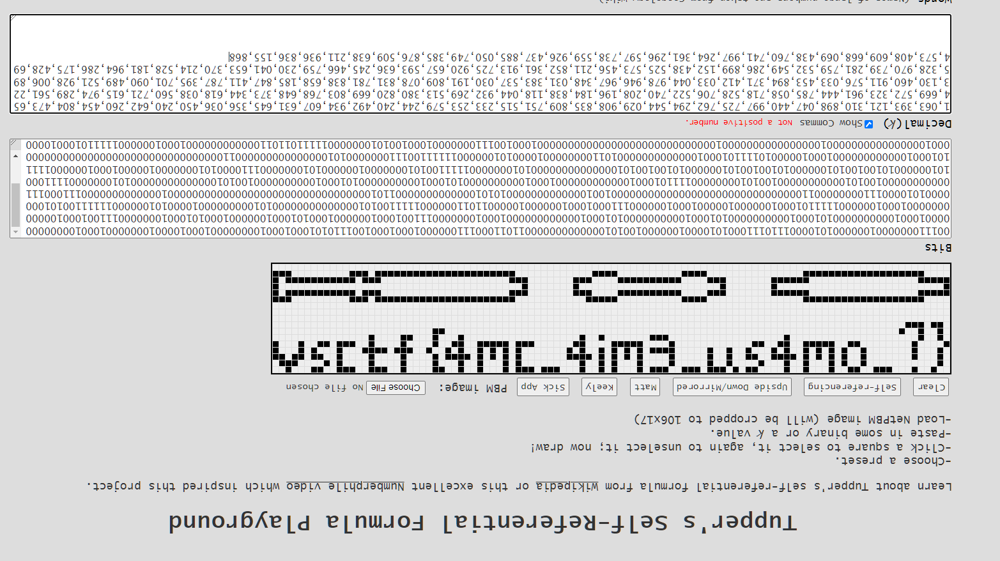

# Writeup

1. We are given a password encrypted zip file. There are 5 text files inside, each of 4 bytes. We can use CRC32 to easily crack their data using any online script.

```py
from zipfile import ZipFile
import itertools, binascii

def permutations_with_replacement(szDic, k):
    result = []
    for i in itertools.product(szDic, repeat = k):
        result.append(''.join(i))
    return result

def multiCrack(iSize,lCrcs):
    dic = '''abcdefghijklmnopqrstuvwxyz0123456789ABCDEFGHIJKLMNOPQRSTUVWXYZ!-@_{}'''
    dResult = {}
    mydic = permutations_with_replacement(dic,iSize)
    for i in mydic:
        txt = "".join(i)
        crc = binascii.crc32(txt.encode())
        if str(crc) in lCrcs:
            print(hex(crc)+" "+txt)
            dResult[str(crc)] = txt
    return dResult

def crack(lFilesCRC):
    lResult = []
    iSizes = set([int(i.split('|')[1]) for i in lFilesCRC])
    for iSize in iSizes:
        lCrcs = [i.split('|')[2] for i in lFilesCRC if i.split('|')[1]==str(iSize)]
        dTMP = multiCrack(iSize,lCrcs)
        for k,v in dTMP.items():
            for i in lFilesCRC:
                if i.find(k)>0:
                    lResult.append(i+" "+v)
    return lResult

if __name__ == "__main__":
    myzip = ZipFile(r"Sheep loves Maths.zip")
    fInfos = myzip.filelist
    lFilesCRC = []
    for i in range(len(fInfos)):
        fInfo = fInfos[i]
        if fInfo.file_size < 5:
            lFilesCRC.append(fInfo.filename + '|' + str(fInfo.file_size) + '|' + str(fInfo.CRC))
    print(lFilesCRC)
    print(sorted(crack(lFilesCRC)))
```

Output:

```
['pass_1.txt|4|3936767950 crc_', 'pass_2.txt|4|3531727445 15_f', 'pass_3.txt|4|835466726 un_m', 'pass_4.txt|4|4133639658 4th5', 'pass_5.txt|4|4114662876 !@@!']
```

Concatenating the data gives zip password `crc_15_fun_m4th5!@@!`.

2. When we open `Diary 1.py` we can see a simple Python program related to OEIS. We can get the sequence and solve for the url. Note some slots may have multiple solutions so you can use request module to see if that website is alive. Eventually we should get https://challs.vsc.tf/sheep-diary-xcw7pbx1.

3. We can see a nonogram and it clearly is going to plot a QR Code. We can solve it either manually or online. Note that there are multiple solutions to the nonogram so it's recommended to solve it with tools that yield a lot of different solutions.


Scanning it gives a pastebin link `u.nu/MSuLm`.

4. We can see the following text in pastebin file:

```
Maths is beautiful because it is self-referential; sometimes the number can draw itself...
 
Here is your flag: 1063393121310898047440997725762294544029908835809751515233253579244240492934607631645356036450240642260454804473654669572323961444785058718528706522740208196184838118044932269513380820669803768648373344618038560721615974289561223130460911576033453894371412033044978946967348031383537030191809078831781838658185847411787395701090489521928006895328970739281759532549286899152438525573456211852361913725920657593636245466759230041653370214528181964286175428694573408609668069438760741997264361296597738559926437885050749385876509638211936836155868
 
The Sheep,
Jun 17, 2022
```

If we search for things like *self-referential maths draw*, the challenge hinted towards [Tupper's self-referential formula](https://en.wikipedia.org/wiki/Tupper%27s_self-referential_formula), a formula that visually represents itself when graphed at a specific location in the (x, y) plane.

We can find any online visualizer and input that number to get flag. (Note: Some tools will plot it upside down so I flipped the image here)
https://keelyhill.github.io/tuppers-formula/?preset=37lLbhHQaBQ4BBbXPaP09bUSlPgS2VU4hFFtVqhoV7Q4HDyxVRrxHmWlJ3oD5JurdTZML4I2I3bzzgSITgow5iMxnnVenT52zzRm6MPilQRm0s9Sa5xlG1Kd8Vb9kSxTGvd4HUing7ainROT15PCB6JseakndKrO5oG5mEfKmantsfO51Pr9WunonGhozY34LYfZrqCtYCpofjS7XEc2YVqIIJmli5wXbp3yFqNfsdCNrkSlZkZ7UH4T4pNbMW7h322SAl8oA4JAAymrEA0nrRNuZOPEbC3euhBYWQ8Ebb52LrS


Flag is `vsctf{4mc_4im3_us4mo_?}`.